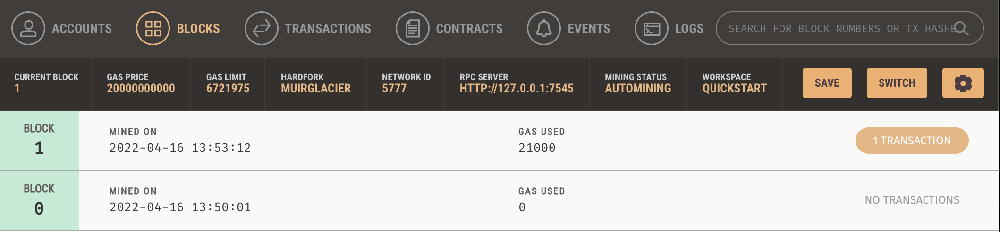

# Blockchain-wallet
Unit 19 Homework: Cryptocurrency Wallet

## Background: 
I work at a startup that is building a new and disruptive platform called Fintech Finder. Fintech Finder is an application that its customers can use to find fintech professionals from among a list of candidates, hire them, and pay them. As Fintech Finder’s lead developer, I have been tasked with integrating the Ethereum blockchain network into the application in order to enable your customers to instantly pay the fintech professionals whom they hire with cryptocurrency.

## My Streamlit Application:

I have decided to hire and pay Jo since she has a great fintech rating of 4.7 and doesn't request too much ehteruem. For this transaction, I paid her for 20 hours of work at a rate of 0.19 Ethereum per hour. This transaction costed me 3.8 Ethereum. 

## Validation Hash from Steamlit after sending transaction:

## My account balance before and after transaction (Ganache):

## Transaction details on Ganache:

## The Block and Recipt on Ganache: 

