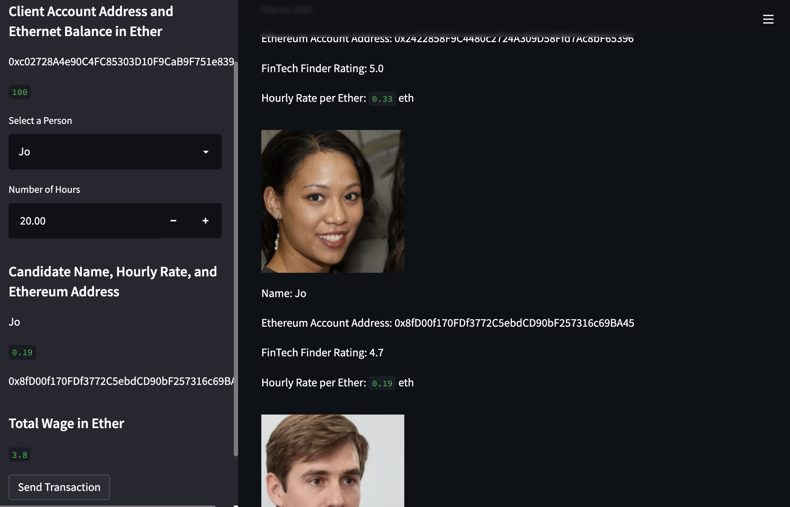
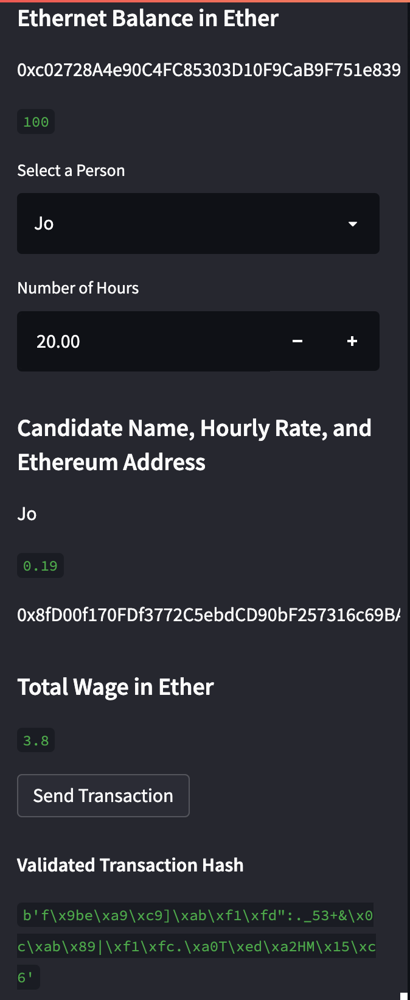
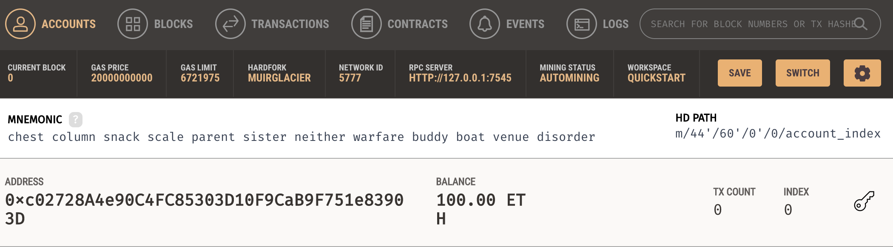
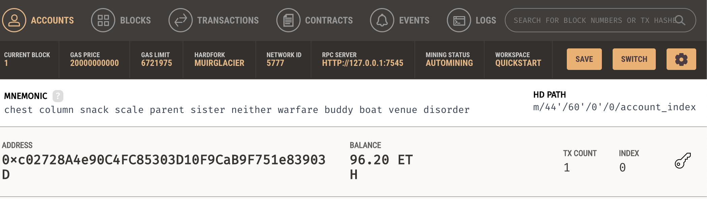
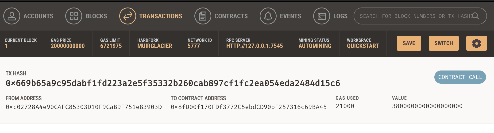
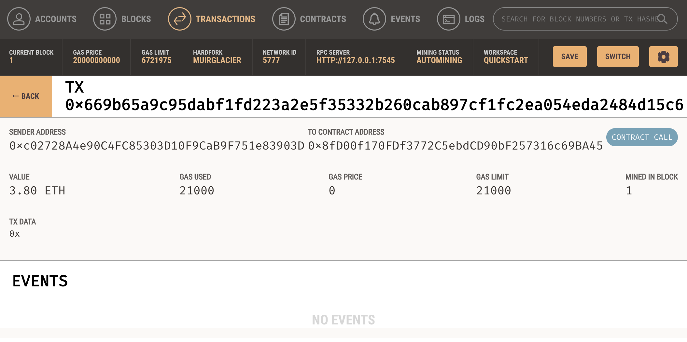
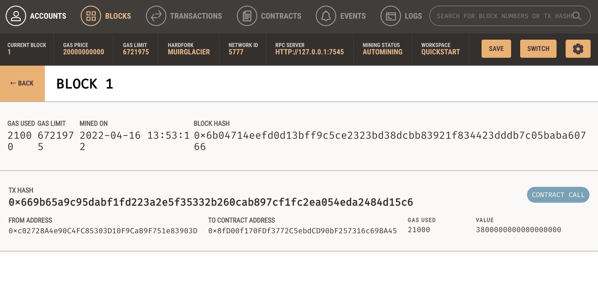

# Blockchain-wallet
Unit 19 Homework: Cryptocurrency Wallet

Streamlit Application:

Validation Hash from Steamlit after sending transaction:

My account balance before and after transaction (Ganache):

Transaction detaila on Ganache:

The Block: 

